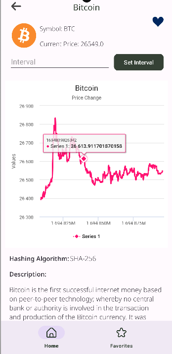

 

  
  
  

## Table of Contents

* [About the Project](#about-the-project)
* [Login Credentials](#login-credentials)
* [Architecture](#architecture)
* [Features](#features)

## About The Project
  
Coin Library is a cryptocurrency tracking application. CoinGecko crypto API was used to get the latest prices and histories for coins. You can subscribe to the application using the Firebase E-mail service and view the coin list. You can create your own coin favorite list.

## Login Credentials
- E-mail: nisa@coinlibrary.com
- Password: 123456

## Architecture
MVVM (Model-View-ViewModel) architecture pattern and view binding is used in the development of this application. The development language of the application is Kotlin.

* Architecture;
    * [View Binding](https://developer.android.com/topic/libraries/view-binding)
    * [ViewModel](https://developer.android.com/topic/libraries/architecture/viewmodel)
    * [Hilt](https://developer.android.com/training/dependency-injection/hilt-android) 
    * [Navigation](https://developer.android.com/guide/navigation)

* Third parties;
    * [Kotlin Coroutines (Kotlin flows)](https://developer.android.com/kotlin/flow)
    * [Flow](https://developer.android.com/kotlin/flow)
    * [Room](https://developer.android.com/training/data-storage/room)
    * [Retrofit](https://github.com/square/retrofit)
    * [MPAndroidChart](https://github.com/AAChartModel/AAChartCore-Kotlin)
    * [Glide](https://bumptech.github.io/glide/) 
    * [Firebase](https://firebase.google.com)
    * [Firebase Auth](https://firebase.google.com/docs/auth)
    * [Chuck](https://github.com/ChuckerTeam/chucker)
  
## Features
  - Users can sign up by e-mail and can save their own favorite coins.
  - The users can view all coins information; such as name, symbol, current price, price change percentage, etc.
  - The users can view selected coin details, Hash algorithm information, explanation. On the detail page, the users can add or remove the coin to their favorites.
  - The users can search by coin name or symbol on the home page.

